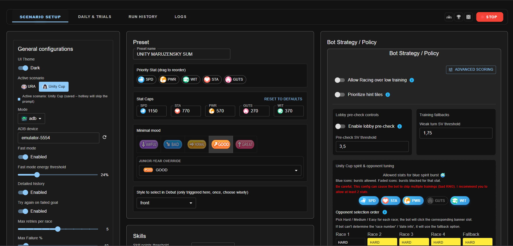
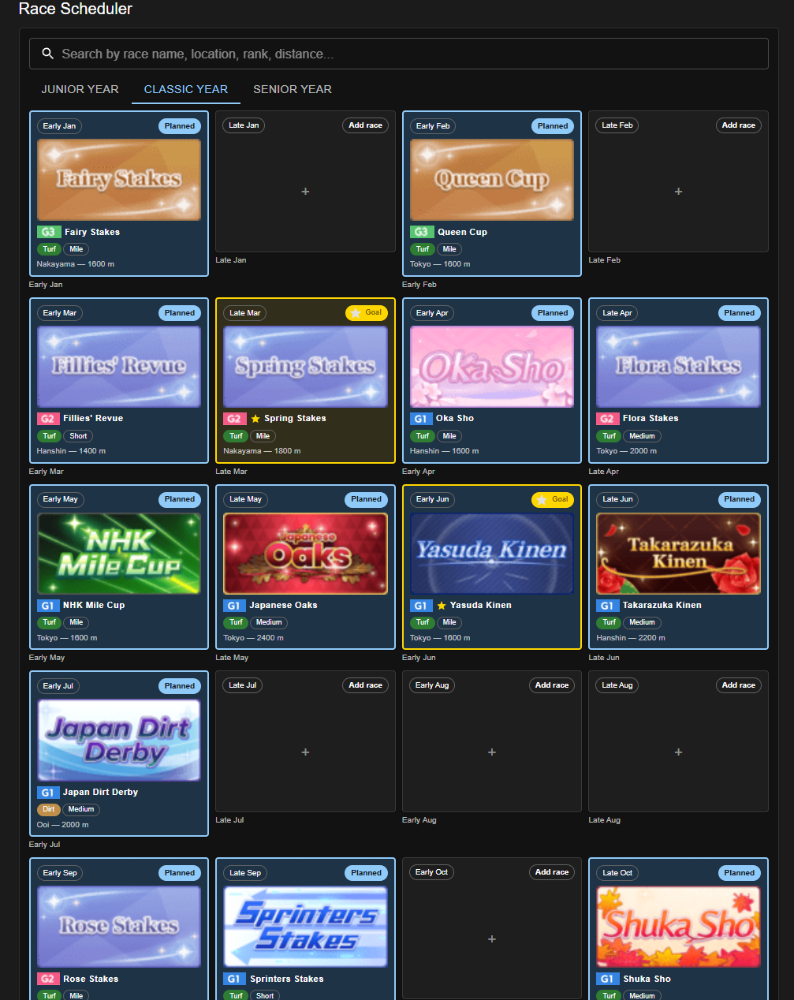

# Umamusume Auto Train

This project is an **AI bot for Umamusume: Pretty Derby** that automates training, races, and skill management. It helps you **farm fans, clear goals, and optimize stats** without grinding manually.

It works on:

- **Steam (PC)**, check a full run in: https://www.youtube.com/watch?v=smNZnwD1QI4
- **Android (via scrcpy)**, check a full run in https://www.youtube.com/watch?v=sD9CjXORIUM (inside Virtual Machine)

It is using a mix of **YOLO object detection, machine learning, OCR, and custom logic** to play like a human.

Whether you want to **auto race G1s, plan a training schedule, or run 24/7 farming**, this tool provides a flexible and safe way to streamline your Umamusume career runs.

It’s based on and improved from:

- [Magody/Umaplay](https://github.com/Magody/Umaplay) (upstream)
- [shiokaze/UmamusumeAutoTrainer](https://github.com/shiokaze/UmamusumeAutoTrainer)
- [samsulpanjul/umamusume-auto-train](https://github.com/samsulpanjul/umamusume-auto-train)

## THIS Fork

Im not big on versioning so here are my changes so far (AI ofcourse):

An enhanced fork of Magody's Umaplay — an Umamusume career-automation bot (YOLO + OCR perception → decision → action). This fork focuses on speed (aggressive OCR reduction and pacing controls), new automation surfaces (Unity Cup scenario, daily activities, run history), and robustness (self-healing stuck-screen recovery).

**How this fork differs from upstream**

| Area                     | What this fork adds                                                                                                                               |
| ------------------------ | ------------------------------------------------------------------------------------------------------------------------------------------------- |
| ⚡ Performance           | Batched per-turn OCR, win-detection without OCR, poll-until-settled scans, and user-tunable pacing multipliers throughout the race/training loops |
| 🏆 Unity Cup scenario    | Full showdown flow — opponent selection, in-place result walk, scaled pacing, text-driven fallbacks                                               |
| 📅 Daily automation      | Team Trials, Daily Races, Daily Legend chaining, and a shop "buy all" flow — all on hotkeys (F7/F8/F9)                                            |
| 📊 Run history & data    | Per-run detail storage, turn logs, race-outcome consolidation, and a history UI                                                                   |
| 🎯 Character goal system | Character scraper + datasets, goal-anchored turn-date inference, character selector UI                                                            |
| 🛠️ Platform              | ADB device discovery/picker, headless-safe hotkeys (Linux/Docker)                                                                                 |
| 🩹 Robustness            | Post-race stall recovery, hardened race-confirm clicks, shared Connection Error recovery                                                          |

**Key optimizations**

- **OCR reduction** — win checks read a row-1 highlight (no OCR); lobby stat + date-pill reads are batched into single calls; race-result reads gate on a confirmed leaderboard; per-scroll skill-cost OCR anchors to the BUY button.
- **Pacing controls** — race-entry waits, post-training pause, skill-shop scroll budget, and Unity showdown sleeps are all scaled/configurable instead of hard-coded blind sleeps.
- **Poll-until-settled** — training scans exit as soon as the frame stabilizes rather than waiting a fixed post-click delay.
- **Scenario-aware training** — early-exit threshold scales per scenario and counts signal-bearing supports, not raw headcount.

**Changelog**

- Unity Cup scenario
  - Optimizations to the Unity run
  - Actively advance to opponent banners on race day
  - Drive the full showdown result walk in-place
  - Stop dead-polling race_after_next on normal race results
  - Convert begin_showdown blind sleeps to scaled beats + polls
  - Restore lost scenario event rows; unloop the Unity Cup Tutorial
- Performance / OCR
  - Batch lobby per-turn stat + date-pill OCR reads
  - Gate race result read on a confirmed leaderboard (no extra OCR)
  - Optimize race flow: row-1 win check, batched OCR, poll/scalable awaits
  - Scale race entry-path waits with pacing + trim redundant nav settle
  - Training scan: poll-until-settled instead of fixed post-click sleep
  - Optimize training scan: dedupe BGR convert, drop useless OCR retry
  - Trim post-training-click blind pause (5s → 3s)
- Daily automation
  - Fix daily races / team-trials shop + Daily Legend chaining
  - Add shop "buy all" feature
  - Implement DailyLegendRaceFlow, chain after daily race
  - Add features to dailies
  - Web UI: Logs tab + daily-action buttons (F7/F8/F9); move daily actions into the header
- Training policy
  - Scale early-exit threshold by scenario; count signal not headcount
  - Auto-exit training when energy and WIT aren't worth it
- Race flow & scheduler
  - Harden race-confirm clicks; handle goal-race-only turns; clear post-race reaction stall
  - Accept OK on the popup-confirm step, not just RACE
  - Better race selector UI; auto-fill goal races, dark mode, nav skip
- Skills
  - Make skill-shop scroll budget and early-stop patience configurable
  - Fix skill cost OCR by anchoring ROI to the BUY button
  - Fix skills SP read on letterboxed phone screens
  - Skill-point algorithm improvement; SP early-exit + batch OCR per pass
- Run history & data collection
  - Consolidate race outcomes into turn log; split run detail into per-run files
  - Precomputed count fields; detail fetch on dialog open
  - History UI + data collection
- Character goal system
  - Character data infrastructure: scraper, datasets, server API, TS types
  - Character selector UI + preset charId binding
  - Goal-anchored turn-date inference; show goal races in history
- Events
  - Replace Unity Cup Tutorial 5-option menu with a Yes/No gate
  - Label Unity Cup Tutorial options so they're pickable in the UI
  - Open scenario event-options dialog even with no catalog entry
- Platform & config
  - ADB device discovery + picker in General settings
  - Headless-safe global hotkeys (Linux server / Docker)
  - Group performance/timing knobs; make post-training pause configurable
- UI improvements:
  
  - Start/stop buttons in the Web UI — eliminates the keyboard dependency, making the bot runnable on macOS and Linux without a keyboard hook
  - Redesigned race scheduler with an in-game-like calendar system
    
    - Goal races highlighted in yellow
    - Clicking a goal opens an in-game-style popup; selecting a race auto-navigates to the next eligible date
      
  - New run logs tab:
    
    - Drill-down details showing the bot's decisions and race placements per turn
      


---

## 💬 Discord

Wanna drop a quick thought, idea, or just hang out? Come say hi either in Issues section or in discord:

<p align="left" style="margin-top: 12px;">
  <a href="https://discord.gg/JtJfuADDYz" target="_blank" style="text-decoration: none;">
    
  </a>
  <a href="https://discord.gg/JtJfuADDYz" target="_blank">
    
  </a>
</p>

<p>
  <a href="https://discord.gg/JtJfuADDYz" target="_blank">https://discord.gg/JtJfuADDYz</a>
</p>

---

## ⚠️ Disclaimer

Use this bot **at your own risk**.
I take no responsibility for bans, issues, or account losses that may result from using it.

---

## ✨ Features

- **Smart Training** – Chooses the best option using a point system (rainbows, director, hints, etc.).
- **Human-like Input** – Random clicks, delays, and jitters to stay natural.
- **Full Tracking** – Monitors mood, stats, skills, goals, and energy.
- **Health & Energy** – Rests or uses the infirmary automatically.
- **Events** – Event option selector and character-specific overrides.
- **Races** – Schedule in advance and auto-pick optimal races.
- **Skills** – Buys and prioritizes selected skills automatically.
- **Goals & Styles** – Handles special goals and lets you set racing style.
- **Cross-Platform** – Works on PC (Steam), Android (scrcpy/Bluestacks), and **Linux via Wine**; resolution independent but OCR works better on bigger resolutions.
- **Claw Machine** – Supports the claw mini-game.
- **Hints** – Prioritize skill hints when enabled, with automatic de-prioritization when the skill is already learned.
- **Skill Memory** – Tracks purchased skills per run to prevent double-buying single-circle variants and coordinate hint scoring.
- **Web UI** – Manage presets (stats, races, events), adjust advanced settings, switch modes, and update directly from GitHub.
- **Auto Team Trials** – Automatically plays Team Trials with F7 hotkey, handles shop purchases, session resume, and respects your banner preference (1-3). You need to be in the race screen where the team trials, room match, daily races are.
- **Auto Daily Races** – Automates daily races with F8 hotkey, manages shop purchases and session resume. You need to be in the race screen where the team trials, room match, daily races are.
- **Auto Roulette / Prize Derby** – Automatically spins the Roulette/Prize Derby (F9 hotkey) with smart button state detection.
- **URA and Unity Cup Supported!**

---

### Before You Start

Make sure you meet these conditions:

- Disable all in-game confirmation pop-ups in settings.
- Start from the **career lobby screen** (the one with the Tazuna hint icon).
- Set in Umamusume config **Center Stage** (Race recommendations)
- It works on the primary display only, don't move the game to second screen.
- GPU optimizations:
  - **NVIDIA**: Detailed in [README.gpu.md](docs/README.gpu.md).
  - **AMD (Experimental)**: Detailed in [README.amd_gpu.md](docs/README.amd_gpu.md).
    > ⚠️ **AMD Users**: This experimental ROCm fork has been tested on **RX 7900 GRE**. It offloads YOLO to the GPU (2-3x speedup) but runs OCR on CPU to avoid crashes. See the guide for specific installation steps.

---

## 🚀 Getting Started

### Installation (Windows)

> **Linux/Wine Users:** See [Wine Setup Guide](docs/README.wine.md) for Linux-specific installation instructions.

### 🛠️ Required Software Installation

#### Step 1: Install Required Programs

1. **Install Git** (for downloading and updating the bot)
   - Download from: [git-scm.com](https://git-scm.com/downloads)
   - Run the installer with all default settings

2. **Install Anaconda** (required for Python environment)
   - Download Anaconda: [anaconda.com/download](https://www.anaconda.com/download)
   - Choose the **64-bit Windows Installer**
   - During installation:
     - Check "Add Anaconda to my PATH environment variable"
     - Select "Register Anaconda as my default Python"
   - Complete the installation

#### Step 2: Download and Set Up the Bot

1. **Open Command Prompt**
   - Press `Windows + X` and select "Windows Terminal" or "Command Prompt"

2. **Clone the Repository**
   Copy and paste these commands one by one, pressing Enter after each:

   ```bash
   git clone https://github.com/Magody/Umaplay.git
   cd Umaplay
   ```

3. **Set Up Python Environment**

   > ⚠️ **AMD GPU Users**: Stop here! Please follow the instructions in [docs/README.amd_gpu.md](docs/README.amd_gpu.md) to set up your environment with ROCm support. Do not create the Python 3.10 environment below.

   ```bash
   conda create -n env_uma python==3.10
   conda activate env_uma
   python -m pip install -r requirements.txt
   ```

   - Type `y` and press Enter if prompted to proceed
   - This may take several minutes to complete

#### Step 3: Verify Installation

After everything is installed, you should see `(env_uma)` at the beginning of your command prompt line, indicating the environment is active.

> 💡 **Troubleshooting**: If you get a "conda is not recognized" error, close and reopen your command prompt, then try again. If you get some error with library version, try to remove all versions from requirements.txt and run `pip install -r requirements.txt` again. So you get the latest versions for python 3.12 or 3.13. I recommend you to use 3.10.

If you face OCR errors, reinstall **paddle** and **paddleocr**:

```bash
pip uninstall -y paddlepaddle paddlex paddleocr
python -m pip install paddlepaddle
python -m pip install "paddleocr[all]"
python -m pip install paddlex
```

#### Step 4: Running the Bot

1. Open Command Prompt and navigate to the Umaplay folder
2. Run these commands:
   ```bash
   conda activate env_uma
   python main.py
   ```

- Press **F2** to **start/stop** the bot during gameplay (YOU MUST BE on **career lobby screen** (the one with the Tazuna hint icon)). Or F7, F8, F9 depending on your configs.

---

#### Updating the Project

I regularly push new updates and bug fixes. To update:

**Option 1: Using Web UI (Easiest)**

- Use the **Pull from GitHub** button in the Web UI
- There's also a **Force Update** button if needed
- **Restart the bot after updating. Close all terminals / IDEs and do a fresh start**


**Option 2: Manual Update**
Open Command Prompt in the Umaplay folder and run:

```bash
conda activate env_uma
git reset --hard
git pull
pip install -r requirements.txt
```

Then **Restart the bot after updating. Close all terminals / IDEs and do a fresh start**

> ⚠️ **Note**: `git reset --hard` will discard any local changes you made to files.

---

#### Future: Working on creating releases when versioning

I'm trying to precompile everything in a Windows executable, but I still recommend you to use the first option with python and Conda; this will allow you to easily have the last version.

(Because I'm not able to reduce the size of this exe yet; specially for 'torch')


---

### Android

#### Scrcpy (Recommended)

Scrcpy is a tool to 'mirror' your Android screen, and emulate 'touchs' over it and it requires developer mode.

- Download Scrcpy [Official Repo scrcpy](https://github.com/Genymobile/scrcpy/releases).
- You need **developer mode** (usually you get this by tapping multiple times the android version in the phone settings).
- You MUST enable the USB debugging (Security Settings), so the program can emulate the input; making this solution 99.9% undetectable by any anti-cheat (Although I also set a kind of human behaviour when clicking). Then you need to connect the phone through USB to the PC or VM.
- In general, follow the instructions in [scrcpy readme](https://github.com/Genymobile/scrcpy) to properly setup this.

Once it is installed, you only need to set 'scrcpy' option and save config in http://127.0.0.1:8000/ (read WEB UI section)
**Important**: Don't forget to set the window title, in my case for Redmi 13 Pro the title is '23117RA68G'


#### BlueStacks

I created a version for Bluestacks, you only need to set 'bluestacks' option and save config in http://127.0.0.1:8000/ (read WEB UI section). But I didn't tested enough here, I recommend you to use Scrcpy is lighter and more "native".

#### Using the ADB controller (BlueStacks/LDPlayer/Android)

ADB mode lets the bot send taps without hijacking your mouse. To enable it:

1. **Install Android Platform Tools**
   - Download the ZIP for Windows from Google's official page: <https://developer.android.com/tools/releases/platform-tools>.
   - Extract it somewhere permanent, e.g., `C:\Android\platform-tools`.
   - Add that folder to your Windows `PATH` (System Properties → Advanced → Environment Variables).
   - Open a _new_ terminal and run `adb version` to confirm it works globally (no need to `cd` into the folder anymore).

2. **Enable/verify ADB on your emulator/device**
   - BlueStacks: Settings → Advanced → _ADB Debugging_ → Enable remote connection. Use `localhost:5555` by default.
   - LDPlayer 9: Settings → Otros → _Depuración de ADB_ → "Abrir conexión remota". The default endpoint is also `127.0.0.1:5555`.
   - Physical/other Android devices: enable Developer Options + USB debugging.

3. **Connect the device manually before launching the bot**

   ```cmd
   adb start-server
   adb connect 127.0.0.1:5555   # adjust port if your emulator uses another (e.g., 62001)
   adb devices                 # should list 127.0.0.1:5555 as "device"
   ```

   If it shows `offline` or nothing, fix the emulator settings first.

4. **Configure Umaplay** (Web UI → General tab)
   - Set **Mode** = `adb` (or `bluestack` with `Use ADB` checked if you still want the BlueStacks window-focus path).
   - Turn on **Use ADB** and set **ADB Device** to the host/port you connected (e.g., `127.0.0.1:5555`).
   - Click **Save Config**.

5. **Run the bot**
   - Launch `python main.py`, press F2, and the controller will reuse the already-connected device.
   - If the log shows `Could not connect to ADB device`, re-check that `adb devices` lists it and that `adb` is still available in PATH.

---

## WEB UI

You can change the configuration at http://127.0.0.1:8000/


Unity Cup scenario is fully supported, with dedicated strategy controls:


**Important: Don't forget to press 'Save Config' button**

> ⚠️ **Critical Setup Reminder**: For reliable runs, always set **all of the following** in the Web UI before starting the bot:
>
> 1. **Deck preset** (select the support deck you actually loaded in-game)
> 2. **Scenario preset** (e.g., Grand Masters, Aoharu, Make a New Track)
> 3. **Trainee preset** (the exact character you are training this run)
>
> Mismatched deck/scenario/trainee selections cause portrait matching, skill memory, and event overrides to fail, so double-check these three fields each time you swap accounts, decks, or seasonal alts.

You can set:

- **General configurations** (window title, modes, fast mode, advanced settings)
- **Presets** (target stats, priority stats, moods, skills, race scheduler)
- **Responsive layout**: left = General, right = Presets (collapsible)
- **Save config**: persists changes to `config.json` in the repo root (via backend API).
- **Events selector**: Like in Gametora, to can select the card but also you can 'tweak' the event option (it is still experimental, but it worked for me):
  


- **Schedule races**:
  

- **Shop Configuration (Team Trials / Daily races)**:
  

---

## Known Issues

I tested it in Laptop without GPU and only 8GB RAM and worked, but a little bit slower. Hardware shouldn't be a problem though; of course it works better if you have a GPU. Nevertheless I found some problems when:

- Choosing a character very different from my training dataset (It will be solved later retraining YOLO model with more data)
- Using a slow internet connection: specially in RACES; if internet is very slow the sleep counter will break all the syncronization
- Gold Ship restricted training may not work yet.

## Running as 'client' only

Ideal for running on other machines that may be _slow_ or _outdated_ (such as my laptop and my Vitual Machine in Virtual Box).

The `server\main_inference.py` file is designed to **offload all graphical processing**. This means that whether you’re using an older laptop or running from a virtual machine, you can simply run the following command on your main (powerful) machine:

```bash
uvicorn server.main_inference:app --host 0.0.0.0 --port 8001
```

Then, from your laptop or virtual machine (on the same network), you just need to enable the **Use external processor** option in the Web UI (set it to `True`) and provide your host URL (e.g., `http://192.168.1.5:8001`).

On the _client_ side, you only need the dependencies listed in `requirements_client_only.txt`—no need to install heavy libraries like Torch or YOLO—because all processing is redirected to the `server.main_inference:app` backend running on a separate machine.

This feature is still experimental, but in my experience, it works quite well.

## Running in GPU

Follow the instructions in [README.gpu.md](docs/README.gpu.md)

---

## Running inside Virtual Box

When running inside a **virtual machine** (in the background so you can still use your mouse on the host), it is recommended to limit resources for smoother performance.

Follow the instructions in [README.virtual_machine.md](docs/README.virtual_machine.md)


---

## 🧠 AI Behind the Bot

The bot uses multiple AI components to make decisions:

- **YOLO Object Detection**
  Recognizes 40+ in-game objects (buttons, support cards, stats, badges, etc.).
  Trained on +300 labeled screenshots.

  
  

- **Logistic Regression Classifier**
  Detects whether buttons are active or inactive.

- **OCR (PaddleOCR)**
  Reads numbers, goals, and text with fallback logic.

- **Scoring System**
  Evaluates training tiles based on support cards, rainbows, hints, and risk.

  

- **Label Studio Dataset**
  All models trained with high-quality labels across multiple resolutions.

  

---

## 🆕 Changelog (latest)

### ✨ Umaplay v0.4.0 — Unity Cup & PAL Update

- **Unity Cup upgrades**
  - Uses a heavier YOLO model for better Unity Cup detection.
  - New Unity Cup "Advanced" preset settings (combo scores, spirit multipliers, allowed burst stats, late-season burst prioritization, per-race opponent selection).
- **ADB controller mode**
  - New ADB-based controller path for BlueStacks/Android without hijacking the local mouse. _(CC: @C)_
- **Training & races**
  - Per-scenario "weak turn SV" threshold (separate defaults for URA vs Unity Cup) to decide when a turn is skippable.
  - Optional junior-only minimal mood and tweaks so the bot doesn't over-recreate at full energy.
  - Tentative scheduled races: when marked tentative, the bot can prefer a strong training tile over that race. _(CC: @Rosetta)_
- **PAL policy**
  - Tracks the special "Recreation PAL" icon in lobby and uses PAL dates as a smarter replacement for REST/RECREATION when they give energy or advance chains.
  - Better handling for Tazuna / Riko chains and blue TAP bonuses, especially in Junior. _(CC: @Rosetta)_
- **Web UI & UX**
  - Presets can be grouped, reordered via drag-and-drop, and filtered by group chips; arrow buttons for moving presets were removed. _(CC: @Rosetta)_
  - Unity Cup now starts with a default preset; Event Setup scenario auto-syncs with the active scenario.
  - General layout margins adjusted per feedback. _(CC: @Chat Ja)_
- **Data & infra**
  - Automatic scraping pipeline for in-game data (skills/races/events) integrated into the main flow. _(CC: @Only)_

---

### 🔧 **Bug Fix (v0.3.3)**:

- Ongoing model fixes

**:sparkles: Umaplay v0.3.2 — Parents Quality of Life Update**

### 🆕 What's New in 0.3.2

#### Skills & OCR

- **Disambiguation tokens**: Better OCR separation for pairs like _non-standard vs. standard_ and _taking vs. keeping the lead_, contributed by @Rosetta and @Hibiki.
- **UI polish**: Cleanup courtesy of @exaltedone8267.

#### Skill Memory (New Core Feature)

- **Single-circle guard**: Prevents re-purchasing one-circle skills once acquired.
- **Conditional hint scoring**: Automatically downranks hints for skills that are already bought, highlighting remaining targets. Thanks @sando.

#### Bot Strategy

- **Energy rotation**: User-configurable energy management, implemented with feedback from @Rosetta.

#### Content & Catalog

- **Expanded trainee/support datasets** with a new scraping pipeline (Python CLI documented under `#data-contribution`). Special thanks to @EO1.

#### General Bugfixes

- **Portrait matcher**: More reliable trainee event disambiguation.
- **Team Trials**: Correctly detects all four opponents.
- **Acupuncturist**: Confirmation phase auto-selects accept instead of looping on “reconsider.”
- **Event chains**: Blue-tone validation stops gray UI elements from miscounting chain steps.
- **YOLO + geometry**: Better mapping between hints and support cards to reduce false matches.

#### Misc

- **Preset overlay**: Displays the active preset when the bot boots (and enhanced visibility in the Web UI).
- **CLI**: `python main.py --port <value>` now supported; thanks @ephargy.

> ⚠️ If you encounter critical regressions, roll back temporarily:
>
> ```bash
> git checkout 59a5340f2c014a6d616c63b554bc0fe791513cef
> ```

---

**:bug: Umaplay v0.3.1 — Bugfix Release**

### 🆕 What's New in 0.3.1

#### Skills & OCR

- **Disambiguation tokens**: Better OCR separation for pairs like _non-standard vs. standard_ and _taking vs. keeping the lead_, contributed by @Rosetta and @Hibiki.
- **UI polish**: Cleanup courtesy of @exaltedone8267.

#### Skill Memory (New Core Feature)

- **Single-circle guard**: Prevents re-purchasing one-circle skills once acquired.
- **Conditional hint scoring**: Automatically downranks hints for skills that are already bought, highlighting remaining targets. Thanks @sando.

#### Bot Strategy

- **Energy rotation**: User-configurable energy management, implemented with feedback from @Rosetta.

#### Content & Catalog

- **Expanded trainee/support datasets** with a new scraping pipeline (Python CLI documented under `#data-contribution`). Special thanks to @EO1.

#### General Bugfixes

- **Portrait matcher**: More reliable trainee event disambiguation.
- **Team Trials**: Correctly detects all four opponents.
- **Acupuncturist**: Confirmation phase auto-selects accept instead of looping on “reconsider.”
- **Event chains**: Blue-tone validation stops gray UI elements from miscounting chain steps.
- **YOLO + geometry**: Better mapping between hints and support cards to reduce false matches.

#### Misc

- **Preset overlay**: Displays the active preset when the bot boots (and enhanced visibility in the Web UI).
- **CLI**: `python main.py --port <value>` now supported; thanks @ephargy.

> ⚠️ If you encounter critical regressions, roll back temporarily:
>
> ```bash
> git checkout 59a5340f2c014a6d616c63b554bc0fe791513cef
> ```

---

## 🤝 Contributing

- Found a bug? Open an issue.
- Want to improve? Fork the repo, create a branch, and open a Pull Request into the **dev** branch.

All contributions are welcome!

---

## 💖 Support the Project

If you find this project helpful and would like to support its development, consider making a donation. Your support motivates further improvements! Also let me know on discord if you have a very specific requirement.

[](https://buymeacoffee.com/magody)
[](https://paypal.me/MagodyBoy)

Every contribution, no matter how small, is greatly appreciated! Thank you for your support! ❤️

## Tags

_Umamusume Auto Train_, _Umamusume Pretty Derby bot_, _Uma Musume automation_, _auto-training AI bot_, _Umamusume race bot_, _YOLO OCR bot for Umamusume_, _AI game automation_, _scrcpy Umamusume bot_, _Steam Umamusume auto trainer_, _Python Umamusume AI project_, _open source Umamusume bot_, _Umamusume AI automation tool_, _AI-powered gacha game assistant_, _race farming bot_, _skill farming automation_, _Umamusume AI trainer_, _auto play Umamusume_.
