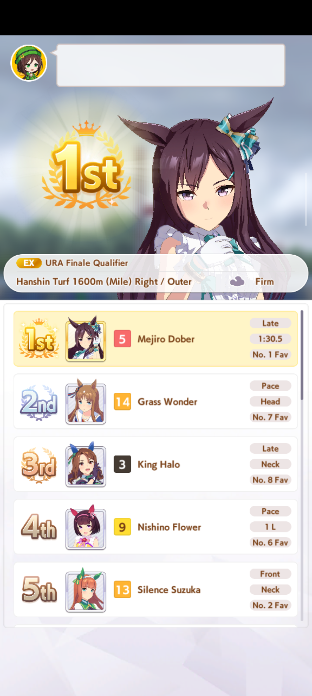
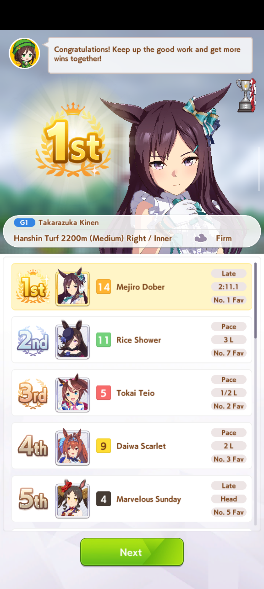

# Race Flow — Execution, OCR & Await Optimization

**Status:** Implemented (2026-06). This doc describes the race-day execution flow
in [`core/actions/race.py`](../../../../core/actions/race.py) and records the OCR/await
optimizations applied to it. Line numbers drift — methods are named so they stay
findable.

---

## 1. Race-day flow

Entry point is `RaceFlow.run(...)`, which drives selection → pre-race lobby, then
hands off to `RaceFlow.lobby()` for the race + result handling.

```
run():
  _ensure_in_raceday()         # click RACES; confirm race_square visible (handles consecutive-race popup)
  _pick_race_square()          # pick the target/best race card (scroll up to max_scrolls)
    └─ no square found? → _is_goal_race_only_screen() fallback (see below)
  click green RACE (list)      # + reactive popup confirm — require_text_match=True (see below)
  wait for pre-race lobby      # poll for button_change (no blind sleep)
  set_strategy()               # optional, if select_style
  lobby():
    _pick_view_results_button()           # already-raced? → View Results path
    else: click green RACE → skip loop    # screen 1: skip the race animation
      → results gate (_wait_for_results_screen)   # confirm leaderboard up
      → win check (_row1_is_win)                  # screen 2: result leaderboard
      → CLOSE (trophy)                            # screen 3, wins/G1 only
      → TRY AGAIN probe / retry                   # loss handling
      → _advance_past_reaction_screen()           # tap through uma placement reaction
      → NEXT / NEXT                               # screen 4
```

### Goal-race-only screen (`_is_goal_race_only_screen`)

On a mandatory goal-race turn, `_pick_race_square` can legitimately find no
clickable `race_square` in two different states, both meaning "nothing to
pick, the goal race is already selected — just confirm it":

1. **Race list, locked.** The game shows the race list with every non-goal
   card locked (`'You can only compete in the goal race.'`), and those lock
   popups occlude the star icons so every square fails the `>= MIN_STARS` gate.
2. **Confirm popup, direct.** For a *planned/desired* race (`RaceIndex`-driven),
   the game can skip the list screen entirely and open the `Race Details ...
   Enter race?` confirmation popup directly — so `race_square` is never
   rendered at all (`squares=0` across every scroll attempt).

`_is_goal_race_only_screen` OCR-detects either case (gated on a `button_green`
still being present) and `run()` skips straight to the green-RACE
confirm step instead of failing with `NO_RACE_SQUARE`.

> Debug: `[race-ocr]` tag. `_pick_race_square` logs
> `squares=/stars=/badges=` per scroll pass; the goal-only probe logs
> `matched=`, detected classes, and the OCR text read off the screen.

### Popup-confirm click hardening (`require_text_match`)

`Waiter.click_when`'s single-candidate and `prefer_bottom` fast paths click
whatever lone/bottom-most `button_green` is on screen **without ever checking
`texts`** — that verification only runs as a last resort when 2+ candidates
exist and `prefer_bottom` didn't resolve one. A stray green button elsewhere
on screen (e.g. a lobby quick-access affordance) could get clicked instead of
the one actually labeled "RACE", silently — this caused an observed
`pre_lobby_timeout` failure where the popup had likely already been dismissed
and the bot then clicked a stray lobby button.

The two race-confirmation calls (`race_list_race`, `race_popup_confirm_try`)
now pass `require_text_match=True`, which forces a real OCR check against
`texts` even through those fast paths. See `Waiter.click_when`'s docstring in
[`core/utils/waiter.py`](../../../../core/utils/waiter.py) — the flag defaults
to `False`, so no other caller's behavior changed.

### Post-skip screens

| # | Screen | Detect / handle |
|---|--------|-----------------|
| 1 | **Skip** the race animation | greedy skip loop clicks `button_skip` (`random.randint(3,5)` per press; `skip_clicks > 2` floor before it may break on NEXT) |
| 2 | **Result leaderboard** — placement emblem + race banner + rows + NEXT | win/loss via `_row1_is_win` (color sample, no OCR); debug saved to `debug/race/placement/*_win.png` / `*_loss.png` |
| 3 | **Trophy** (wins, esp. G1) | `CLOSE` button (`tag="race_trophy"`); if the skip loop breaks here, `closed_early=True` and the win-check is skipped |
| 3.5 | **Uma reaction to placement** (tap-to-continue, no button) | `_advance_past_reaction_screen()` — see below |
| 4 | **NEXT** screens | `race_after_flow_next`, then `race_after_next` |

### Post-race reaction gate (`_advance_past_reaction_screen`)

Both the skip-loop and View-Results paths can land on a **tap-to-continue "uma
reaction to placement" screen** that shows *neither* NEXT button. Previously the
two after-race NEXT awaits (`race_after_flow_next` 4.6s, `race_after` 6s) both
timed out on it and the flow "finished" while the reaction was still up — the
agent's unknown-screen handler then stalled until a manual tap (a ~2.5-min hang
was observed in the wild). Note the agent's own center-tap safety net is dead
code (`if self.patience > 10 == 0:` in `ura`/`unity_cup` `agent.py`), so it never
rescued this.

Before the NEXT awaits, the bot now nudges through the reaction:

- Poll, capped at `timeout_s` (8s). **Break** the instant a `button_green` /
  `race_after_next` is present (class-presence only, **no OCR**) — the awaits
  below then click the real NEXT.
- Otherwise click a lingering **white button** (`VIEW RESULTS` / `CLOSE`) if one
  is on screen, else **tap center** to advance the tap-to-continue frame.
- Bounded → falls through to the prior NEXT awaits on timeout, so it can never
  hang and is never worse than before.

> **Validated in the wild (2026-07):** on a real Normal-race-day win via the
> View-Results path, the reaction screen had *no* white button, so
> `race_after_reaction_white` timed out and the **center-tap** cleared it in 3
> nudges; NEXT appeared ~8s later (`NEXT visible; ending post-race reaction
> tap-through`) and `race_after_flow_next` clicked it — replacing the prior
> ~2.5-min stall. The center-tap fallback (not just the white-button click) is
> what does the work here.

### Results-screen gate (`_wait_for_results_screen`)

Before reading the result and pressing NEXT (non-trophy path), the bot **confirms
the leaderboard is actually on screen** instead of firing on a mid-transition
frame:

- Poll, one `_collect()` per iteration, **YOLO-only (no OCR)**: confirmed when a
  `race_badge` (result-banner grade badge) **and** a `button_green` (NEXT) are both
  detected (≥0.5 conf).
- Nudges through any lingering `button_skip`.
- Capped by `timeout_s` (6s) → falls back to prior behavior, so never worse / can't hang.
- Returns the confirming frame, **reused for the win-check** to save a recognize.

Why no extra OCR: `Waiter.seen(classes=…)` without `texts=` is a class-presence
check (fast path, zero OCR); OCR only happens when `texts=` is passed. The gate
confirms via `race_badge`/`button_green` classes, so the only OCR in the proceed
path is the actual text-matched NEXT click — unchanged from before.

> Caveat: uses `race_badge` as the leaderboard signal. A debut/maiden result
> screen without a grade badge will time out and fall back (safe, no extra
> robustness there). Watch for `Results screen not confirmed before timeout` in
> debug logs on debut races.

### Retry conditions

The bot only **re-races** in one case — a confirmed loss of a goal race:

- After the race it probes for **TRY AGAIN** (loss indicator), **skipped entirely
  when `_last_won is True`** (A1 already confirmed a win — saves ~3s + 6 detections
  on every winning race).
- Re-races iff `loss_indicator_seen` **and** `Settings.TRY_AGAIN_ON_FAILED_GOAL`:
  `_attempt_try_again_retry()` clicks TRY AGAIN → `_handle_retry_transition()`
  clears interstitials and waits for the lobby/View-Results to reappear → recursive
  `lobby()`.
- Lost but retry disabled → the bot **stops** for a manual decision.

All other "retries" (`_pick_view_results_button` progressive retries, the skip
loop, the reactive confirm loops, the results gate) are navigation robustness, not
re-racing. Background: [`try-again-bug/`](../try-again-bug/).

### Post-skip screens — captured

After tapping **View results** in the lobby, the game walks two screen *types*. The
captures in [`images/`](images/) show a win and a loss of each:

| Image | Screen | Notes |
|-------|--------|-------|
|  | **Placement pose** (win) | Gold-crown `1st` emblem + `TAP`. Appears right after the skip. |
|  | **Placement pose** (loss) | Grey `5th` emblem (no crown) + `TAP`. |
|  | **Results leaderboard (mid-transition)** | Full ranking rendered, but the speech bubble is **empty** and the green **Next** button has **not appeared** — the frame the gate must *not* fire on. |
|  | **Results leaderboard (settled)** | Speech bubble filled + green **Next** present — the confirmed frame. |

These are exactly the false-positive vs true-positive pair `_wait_for_results_screen`
separates: the "no next" frame fails the `button_green` check and keeps polling; the
"with next" frame passes. Two cues live here — the **placement pose** emblem (gold
`1st` vs grey `5th`) and the **leaderboard row-1 highlight** (`_row1_is_win` samples
the cream-saturated top row, valid only on the leaderboard, not the pose). The empty
speech bubble on the "no next" frame is a cheap secondary readiness signal if the
green-button class is ever flaky.

---

## 2. OCR reduction (Part A)

### A1 — row-1 highlight win check replaces full-screen placement OCR

**We only need win/not-win, not the exact placement.** The result leaderboard
highlights the *trainee's* row cream/yellow; every other row is white. The trainee
wins ⟺ they are 1st ⟺ **row 1 is highlighted** — a single color sample, no OCR, no
trainee name.

`_row1_is_win(img)`: content-aware bounds (letterbox-safe, same trick as the skills
SP fix), sample the median color of row 1's name band (content-relative
x `0.34–0.60`, y `0.415–0.485`), convert to HSV, **win = saturation ≥ 0.10**
(highlight) vs ~0 (white). `_last_placement: int` became `_last_won: bool`
(`_record_race_attempt` only needs the boolean).

- **Validated** across all 145 `debug/race/placement/*.png`: perfectly bimodal —
  wins `sat≈0.22 hue≈49`, losses `sat≈0.00`; `0.10` threshold separates every one.
- **Fixed a correctness bug:** the old full-screen OCR regex grabbed the first
  `Nst` among the 5+ rows, mislabeling wins as losses (e.g. a 1st-place win read as
  placement 2). Replaced the two full-screen `ocr.text(img, min_conf=0.1)` reads in
  `lobby()` (View-Results path and skip-loop path).

### A2 — batch the race-name OCR in selection

`_pick_race_square`'s desired-race loop builds every candidate square's title crop
first (pass 1), then OCRs them all in one `ocr.batch_text` (pass 2 matches). Replaces
N sequential per-square OCRs with one batch call; matching logic is byte-identical.
(`batch_text` was verified to return identical output to per-image `text()`.)

### A3 — batch the View-Results button OCR

`_pick_view_results_button` OCRs all `button_white` candidates in one `batch_text`
instead of one call each.

### A4 — drop the double-OCR on the consecutive-race penalty popup

`_ensure_in_raceday`'s post-`RACES` probe loop used to OCR the green OK button
**twice** per hit — once in `seen(classes=("button_green",), texts=("OK",))` to
gate the branch, then again in `click_when(..., texts=("OK",))` to click it — a
~3s stall on the accept path (observed 2026-07: `21:55:41` detect → `21:55:44`
click). In this window a `button_green` with **no** `race_square` present can only
be the penalty popup (a loaded squares screen returns at the `race_square` check
above), so the accept path now detects it **class-only (no OCR)** and clicks via
`try_click_once(classes=("button_green",), prefer_bottom=True)`. OCR is kept only
on the **refuse** branch (`ACCEPT_CONSECUTIVE_RACE` off), where it guards a hard
stop and confirms the button truly reads `OK` before raising `ConsecutiveRaceRefused`.
Net: the common accept path drops from two OCR passes to zero (~3s → ~YOLO-only).

---

## 3. Await reduction & configurability (Part B)

### B1 — drop the blind pre-lobby sleep

The blind `sleep(7)` before the `button_change` poll in `run()` is gone (now a short
`_beat` + the existing poll, capped at 14s) — reclaims up to ~6s/race.

### B2 — `RACE_AWAIT_SCALE` pacing multiplier

`RaceFlow._beat(seconds)` wraps every race animation grace wait and multiplies by
`Settings.RACE_AWAIT_SCALE` (default `1.0`, clamp `0.4–2.0`). Surfaced as the **Race
pacing** slider under **General → Advanced settings → Performance & timing**, wired
through `config.schema.ts` / `types.ts` / `Settings.apply_config`. The entry-path
waits (`_ensure_in_raceday`, `_pick_race_square` per-page settle, `set_strategy`) are
all `_beat`-wrapped, so the slider scales the whole select→confirm→skip flow; the
post-nav settle was trimmed `2s → 0.6s` (redundant with the squares-visible check).

### B3 — skip the TRY-AGAIN probe on confirmed wins

When `_last_won is True`, the ~3s / 6-detection TRY-AGAIN loss probe is skipped
entirely (every winning race). NEXT click timeouts are left as-is — already
poll-bounded by `click_when`.

---

## 4. Status

- [x] A1 — row-1 highlight win check (`_row1_is_win` / `_content_bounds`; `_last_won:bool`)
- [x] A2 — batched race-name OCR in `_pick_race_square`
- [x] A3 — batched View-Results button OCR
- [x] B1 — removed blind pre-lobby `sleep(7)`
- [x] B2 — `RACE_AWAIT_SCALE` + `_beat()` + "Race pacing" slider; entry-path waits scaled
- [x] A4 — class-only accept of the consecutive-race penalty popup (drops double-OCR, ~3s → YOLO-only)
- [x] B3 — skip TRY-AGAIN probe on confirmed wins
- [x] Results gate — `_wait_for_results_screen` (YOLO-only) before win-check / NEXT
- [x] Reaction gate — `_advance_past_reaction_screen` taps through the post-race uma placement reaction before the NEXT awaits (validated in the wild 2026-07: center-tap cleared it, NEXT in ~8s)

**Notes / known trade-offs:**
- Post-strategy beat is scaled via `_beat`, not polled (no clean ready-signal vs
  lobby's own white buttons).
- The banner tie-breaker OCR (top-4 candidates in `_pick_race_square`) is left
  per-call; limited fan-out.
- Results gate relies on `race_badge`; debut races without a grade badge fall back
  to prior behavior.
- Validated: A1 win/loss on real captures (incl. a live 16th-place loss), `batch_text`
  ≡ `text`, settings map+clamp, web build + settings/schema/skills tests green.
